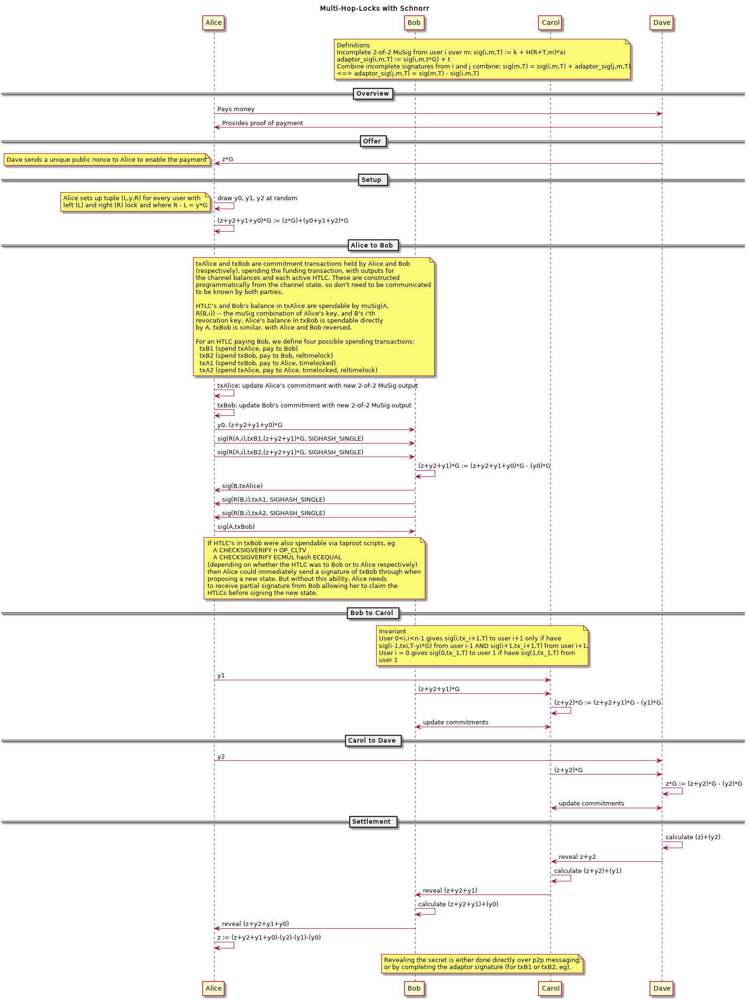

Multi-Hop-Locks from Scriptless Scripts
===========================

Multi-hop locks are based on [atomic swaps](atomic-swap.md)

            * add PoP, add AMP...
            * add to scriptless scripts repo
            * use terminology from repo
            * sources: andrew mailing list and writeup
            * how is different from andrew? not really

